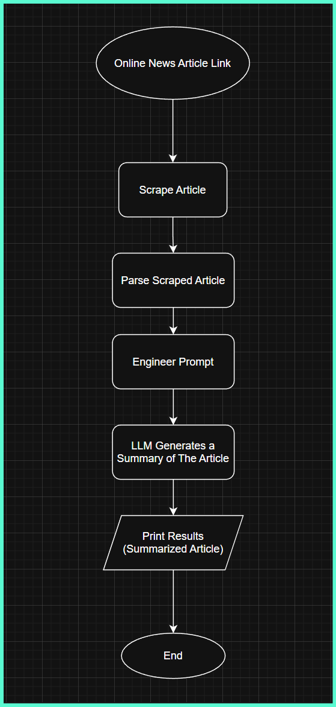
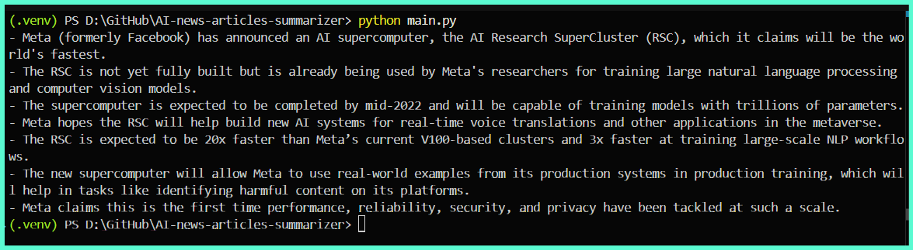

# AI-news-articles-summarizer

Easily summarize news articles using AI. This tool fetches an article, processes it, and provides a concise summary.


## Process Flowchart



## Screenshot

Below is a Screenshot of the app:



## Article Resource

Link: [https://www.artificialintelligence-news.com/2022/01/25/meta-claims-new-ai-supercomputer-will-set-records/](https://www.artificialintelligence-news.com/2022/01/25/meta-claims-new-ai-supercomputer-will-set-records/)


## Setting Up and Activating a Virtual Environment

1. **Create a virtual environment:**

	 ```bash
	 python -m venv .venv
	 ```

2. **Activate the virtual environment:**

	 - **Windows:**
		 ```bash
		 .\.venv\Scripts\activate
		 ```
	 - **macOS/Linux:**
		 ```bash
		 source .venv/bin/activate
		 ```


## Updating PIP


```bash
python -m pip install --upgrade pip
```


## Setting Up .env

Create a `.env` file in the project root to store any required environment variables (such as API keys). Example:

```
API_KEY=your_api_key_here
```

**Notes:**

- A `.env.template` file is provided as a reference for required environment variables.
- You must set the `OPENAI_API_KEY` variable in your `.env` file for this project to work.


## Installing the Requirements

Install all dependencies using:

```bash
pip install -r requirements.txt
```

## Run the App/Script

```
python main.py
```
